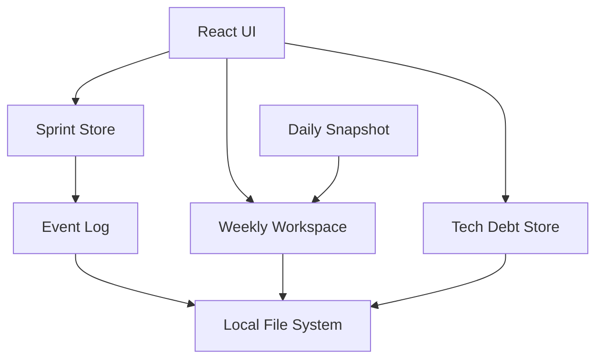
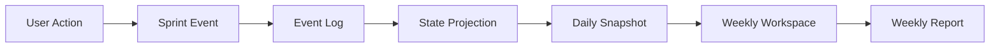

  <h1 align="center">🧭 Compass</h1>
  

    Offline-first work journal and weekly reporting tool for developers
  

  

    Track your work · Understand your progress · Generate weekly reports
  

  

    
    
    
    
  

**Compass** is an offline-first desktop tool that helps engineers **track daily work, understand weekly progress, and generate structured work reports automatically**.

Instead of writing weekly reports from scratch, Compass records your work activity during the week and produces a **clear changelog-style summary** that can be exported as Markdown.

Compass is designed for developers who want a lightweight system to **reflect on work progress, manage personal tasks, and document technical activities** without relying on heavy team management platforms.

## Why Compass Exists

Many engineers experience the same problems that I have:
• Work is spread across multiple tools (Jira, GitHub, Slack, emails).
• Weekly reports take time to reconstruct from memory.
• Personal technical exploration and low-priority work rarely appear in official task trackers.
• Existing productivity tools are either too heavy or too generic.

Compass solves this by acting as a personal work log + task board + weekly reporting engine, designed specifically for developers.

## Compass Philosophy

Compass follows three guiding principles:

> Offline First

- Your work log belongs to you.
  No cloud dependency is required.

> Lightweight but Structured

- Compass focuses on clarity and reflection, not heavy project management.

> Developer-Centric

The tool is built around real developer workflows:

- technical exploration
- debugging sessions
- incremental progress
- personal knowledge tracking

## What Compass Does

Compass combines several capabilities in a single lightweight desktop tool:

• **Sprint Board**  
Track your ongoing tasks and epics with a lightweight personal board.

• **Daily Work Changelog**  
Automatically detect what changed each day in your work.

• **Weekly Report Generator**  
Generate structured Markdown reports ready to submit to your team.

• **Technical Debt Tracker**  
Manage research tasks, investigations, and long-term improvements.

• **Offline-First Data Model**  
All data stays on your machine.

## Architecture

## Data Flow

